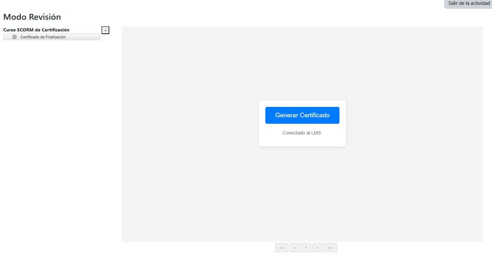

# README del Proyecto: Generador de Constancias SCORM

Este proyecto es un paquete SCORM (Sharable Content Object Reference Model) diseñado para generar una constancia de finalización de un curso y comunicarse con un LMS (Learning Management System) para registrar que el curso ha sido completado.

---
## Características

* **Generación de Constancia Dinámica**: Crea una constancia personalizada con el nombre del estudiante obtenido del LMS, el nombre del curso y la fecha de finalización actual.
* **Comunicación SCORM 1.2**: Se conecta con la API de SCORM de un LMS para:
    * Inicializar la comunicación.
    * Obtener el nombre del estudiante (`cmi.core.student_name`).
    * Marcar el estado de la lección como "completed" (`cmi.core.lesson_status`).
    * Guardar los cambios en el LMS (`LMSCommit`) y finalizar la comunicación (`LMSFinish`).
* **Descarga en PDF**: Permite al usuario descargar la constancia generada como un archivo PDF.
* **Diseño Limpio**: Incluye estilos CSS para una presentación visualmente atractiva de la constancia.

---
## Tecnologías Utilizadas

* **HTML5**: Para la estructura de la página y la constancia.
* **CSS3**: Para el diseño y la apariencia visual.
* **JavaScript (ES6)**: Para toda la lógica de la aplicación, incluyendo la interacción con la API de SCORM y la generación de la constancia.
* **SCORM 1.2**: El estándar utilizado para la comunicación con el LMS, definido en el archivo `imsmanifest.xml`.
* **html2pdf.js**: Una librería externa de JavaScript utilizada para convertir el contenido HTML de la constancia a un archivo PDF descargable.

---
## Cómo Utilizar

Este proyecto está diseñado para funcionar dentro de un LMS que sea compatible con SCORM 1.2.

1.  **Empaquetar el Proyecto**: Comprima todos los archivos del proyecto (`index.html`, `style.css`, `script.js`, `imsmanifest.xml`) en un archivo ZIP.
2.  **Subir al LMS**: Suba el archivo ZIP a su LMS como un nuevo paquete SCORM.
3.  **Lanzar el Curso**: Cuando un estudiante inicie este paquete SCORM desde el LMS, verá un botón para generar su constancia. Al hacer clic, el script se comunicará con el LMS para obtener su nombre, marcar el curso como completado y mostrar la constancia en pantalla, lista para ser descargada.

---
## Generado con Google AI Studio

Este proyecto fue generado con la ayuda de Google AI Studio.

---
## Licencia
Esta obra está bajo una <a rel="license" href="http://creativecommons.org/licenses/by/4.0/">Licencia Creative Commons Atribución 4.0 Internacional</a>.
